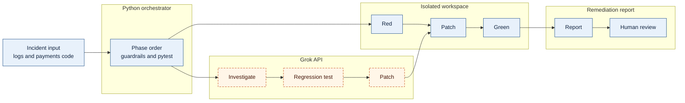

# Architecture

A Python CLI runs a fixed investigation of a small FastAPI payments service. The seeded bug is a double debit when capture is retried after a gateway timeout. Grok reasons inside three calls. Python decides the phase order, applies files, runs pytest, and writes the report.

Python owns the sequence and the guardrails. Grok only reasons. The committed payments tree stays buggy. Each run copies it into an isolated workspace and proves the fix there: the new test fails, the patch lands, then the suite passes.



Artifact names, the tool loop, and the stop-on-failure branches are in the sections below. Investigation may use read-only tools for at most `LEDGER_MAX_TOOL_ROUNDS` rounds (default 8). After that budget, one fresh Grok request with no tools must return the root cause. `python -m ledger reproduce` is outside this graph. It reruns the timeout locally and does not call Grok.

## Layout

```text
payments/
  app.py                         # routes
  store.py                       # ledger, idempotency, seeded bug
  logging.py
ledger/
  __main__.py                    # python -m ledger
  cli.py
  reproduce.py
  agent/
    grok_client.py             # the only Grok HTTP client
    investigate.py             # ingest and root-cause phase
    tools.py                   # read-only tools
    remediate.py               # test, red pytest, patch, green pytest
    report.py                  # blast radius and report.md
incidents/
  INC-1042.json
  logs/INC-1042.jsonl            # written by reproduce
tests/                           # suite that passes with the bug present
runs/                            # gitignored per-run workspace and report
docs/
  requirements.md
  architecture.md
```

One process. Tests use FastAPI's `TestClient`. There is no worker, queue, database server, or UI.

## Execution flow

`investigate` creates `runs/<run-id>/`, copies `payments/` and `tests/` into `workspace/`, and runs the phases below. The CLI prints the phase name as it starts. Each phase writes its artifact before the next one starts.

| Phase | Who decides | Saved artifact |
| --- | --- | --- |
| 1. Ingest | Code | Normalized incident and log slice |
| 2. Investigate | One Grok call, up to `LEDGER_MAX_TOOL_ROUNDS` tool rounds (default 8). At the limit, one fresh no-tool call writes the root-cause JSON | `root_cause.json` and `tool-budget.json`. The prompt already includes the log and `payments/store.py` |
| 3. Test | The next Grok call returns `tests/test_inc_1042.py` only | The test file, then `pytest-red.txt`. The patch call has not happened |
| 4. Patch | A separate Grok call returns `payments/store.py` after the red log exists | `store.diff`. Skipped when the regression test does not fail |
| 5. Verify | Code runs the full pytest suite | `pytest-green.txt` and `sequence.json`. No repair turn |
| 6. Blast radius | Code, from the diff and the capture route | Included in `report.md`. Capture moves money. |
| 7. Report | Code fills a template from the artifacts | `report.md`. No model call. Success is stated only after red, patch, and green. |

The committed payments code stays buggy. Re-running copies a clean tree.

`python -m ledger reproduce` is outside this pipeline. It runs create, authorize, capture with the timeout header, then capture again with the same idempotency key, prints the debit count, and overwrites the incident log.

## Grok API boundary

All model traffic goes through `agent/grok_client.py`.

- `POST https://api.x.ai/v1/responses` with `httpx`.
- `Authorization: Bearer $XAI_API_KEY`. Model `grok-4.7`, overridable with `XAI_MODEL`.
- `previous_response_id` is used only for tool follow-ups inside investigate. The test call, the patch call, and the hypothesis call are new requests that include the saved artifact.
- Investigate tools are local functions. When `output` contains `function_call` items, the orchestrator runs them and posts `function_call_output` with the same `call_id`.
- The test call and the patch call each return one full file as JSON (`path` and `content`), not a unified diff. The patch call runs only after `pytest-red.txt` shows the new test failed.
- Every request and response body is written under `runs/<run-id>/api/` before it is parsed.
- A JSON body may be wrapped in a markdown fence. The client strips one fence and, if parsing still fails, re-asks once.
- HTTP 401 fails immediately. HTTP 429, 5xx, and timeouts retry twice with backoff.
- Dependencies for this client are `httpx` only. The xAI SDK and an OpenAI-compatible client are not used.

Server-side tools are not requested. The client does not stream.

## Tool permissions

| Tool | Who may call it | Constraint |
| --- | --- | --- |
| `read_file`, `search`, `list_dir` | Grok, investigate phase only | Workspace plus the incident log. A path outside that returns an error tool result. |
| File replace | Orchestrator | `tests/test_inc_1042.py` before the patch call. `payments/store.py` only after the red pytest log. At most 150 changed lines against the original. |
| Pytest | Orchestrator | Subprocess `python -m pytest`, 60-second timeout. The model has no shell. |

Tool rounds in investigate stop at `LEDGER_MAX_TOOL_ROUNDS` (default 8). Pending calls past that limit are not executed. One fresh request with no tools must return the root-cause JSON. Unknown tool names return an error result and do not touch the filesystem.

## Design decisions

- **Test call, then patch call.** The fix is requested only after the regression test fails on the unpatched workspace. `sequence.json` is the red, patch, green record.
- **Full-file replacements.** A unified diff is the usual way a model patch fails to apply. The tree is small enough to replace two files.
- **Stop on a surprise result.** A regression test that passes before the patch, or a full suite that fails after it, ends the run as a failure. The report says the remediation did not succeed.
- **Code-owned report.** Blast radius, rollback, and the approval line are written by code from the artifacts. Grok is not asked if its own patch is safe.
- **No repair turn.** A failed second pytest is the result. Another patch cycle is out of scope.
- **HTTP, not an SDK.** Saved request and response bodies are the Grok boundary you can open during the walkthrough.
- **Isolated workspace.** The seeded bug remains the starting point for every run.
- **Pytest in a subprocess.** A timeout is `subprocess.run(..., timeout=60)`. That is not a shell tool for the model.
- **Timeout header.** `X-Simulate-Gateway-Timeout: true` is how tests and `reproduce` hit the 504 path without a real gateway.
- **One incident.** INC-1042 is a duplicate capture after that timeout.
